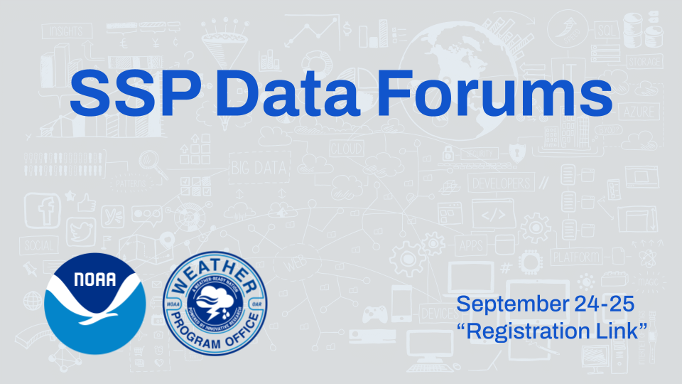

# SSP Data Forums

  More intro language needed soon.

A key part of the Data Forums is the use of [Jupyter notebooks](https://jupyter.org), a web application for producing computational narratives  Jupyter Notebooks are browser applications which run code and renders text, mathematical notation, images and videos. Jupyter notebook is a powerful open source tool for scientific computing, reproducible research and teaching data science.

Come join other instructors, researchers and students at UBC to share their Jupyter experiences and to learn about new Jupyter tools!

## Registration

The Data Forums will be hosted on Vimeo.  Please register at [Link Forthcoming]((https://library.noaa.gov/seminars) to join us!

More information to add.

## September 24, 2025

[**Day 1: Getting started teaching with Jupyter**](schedule/day1.md)

Get up and running quickly with [Jupyter](https://jupyter.org) and start developing content for your courses. Learn about [Syzygy](https://syzygy.ca), [GitHub](https://github.com), [nbgitpuller](https://jupyterhub.github.io/nbgitpuller/), [Jupyter Book](https://jupyterbook.org) and [Python](https://www.python.org) packages for data science.

## September 25, 2025

[**Day 2: Pedagogy and assessment**](schedule/day2.md)

